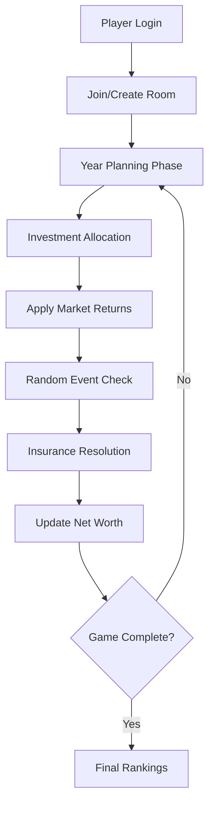

# Vectra
### Financial Life Simulation Game

> **Transform financial literacy into competitive gameplay**

Vectra simulates real-world financial decision-making through an engaging multiplayer experience. Players compete across multiple years, managing investments, risks, and unexpected life events to maximize their net worth.

---

## Core Philosophy

**Learning through Experience**: Rather than traditional financial education, Vectra provides hands-on experience with investment decisions, risk management, and long-term financial planning in a safe, simulated environment.

**Realistic Scenarios**: Every game mechanic reflects real-world financial principles - from compound interest to market volatility, from insurance benefits to emergency fund importance.

---

## Game Mechanics

### Investment Portfolio System
- **Savings Account**: Safe 4% fixed returns, always available
- **Mutual Funds**: Moderate risk with 8-12% returns (Year 2+)
- **Stocks**: High volatility with -10% to +20% potential (Year 4+)
- **Gold**: Hedge against inflation (Year 3+)
- **Real Estate**: Long-term wealth building (Year 5+)
- **Cryptocurrency**: Extreme risk/reward with ±40% swings (Year 6+)

### Risk Management Framework
- **Insurance Products**: Health, disability, and asset protection
- **Emergency Events**: Medical bills, car repairs, job loss scenarios
- **Market Conditions**: Bull/bear markets affecting all investments
- **Life Milestones**: Marriage, children, career changes

### Progression & Strategy
- **Annual Cycles**: Each turn = 1 year of financial decisions
- **Income Growth**: Salary increases based on performance and market conditions
- **Expense Management**: Balance lifestyle inflation with savings goals
- **Strategic Planning**: Long-term vs. short-term financial priorities

---

## Features

### Core Gameplay
- **Multiplayer Rooms**: Create or join games with friends and competitors
- **Real-time Decision Making**: Simultaneous year planning with time-boxed decisions
- **Dynamic Event Engine**: Probability-based scenarios that test financial resilience
- **Performance Analytics**: Detailed breakdown of wealth accumulation and decision impact

### Educational Components
- **Decision Consequences**: Immediate and long-term feedback on financial choices
- **Market Simulation**: Realistic asset class behavior and correlation
- **Risk Visualization**: Clear representation of investment risk vs. return profiles
- **Financial Planning**: Goal setting and progress tracking mechanics

---

## Technical Architecture

### Frontend Stack
- **React 18**: Modern React with hooks and functional components
- **Professional UI**: Dark theme with subtle neon accents for optimal user experience
- **Responsive Design**: Seamless experience across desktop, tablet, and mobile devices
- **Real-time Updates**: Live game state synchronization across all players

### Backend Infrastructure
- **Node.js + Express**: Lightweight and scalable server architecture
- **Supabase Integration**: Real-time database with built-in authentication
- **Game State Management**: Custom engine for financial calculations and event simulation
- **Session Handling**: Secure room-based multiplayer infrastructure

### Security & Performance
- **Environment Variables**: Secure API key management
- **Input Validation**: Client and server-side validation for all user inputs
- **Production Optimized**: Minified builds with efficient asset loading

---

## Quick Start

### Prerequisites
- Node.js 16+ and npm
- Git for version control
- Supabase account (free tier available)

### Installation

```bash
# Clone and navigate
git clone https://github.com/hnikhil-dev/hashit2.git
cd hashit2

# Install all dependencies (frontend + backend)
npm run install-all
```

### Environment Configuration

Create `.env` files in both root and backend directories:

**Root `.env`:**
```env
REACT_APP_SUPABASE_URL=your_project_url
REACT_APP_SUPABASE_ANON_KEY=your_anon_key
```

**Backend `.env`:**
```env
SUPABASE_URL=your_project_url
SUPABASE_ANON_KEY=your_anon_key
SUPABASE_SERVICE_ROLE_KEY=your_service_key
PORT=5000
```

### Supabase Setup
1. Create project at [supabase.com](https://supabase.com)
2. Navigate to Settings → API
3. Copy URL and keys to your `.env` files
4. Enable Google OAuth (optional) in Authentication → Providers

### Development

```bash
# Start both frontend and backend
npm run dev

# Frontend only (port 3000)
cd frontend && npm start

# Backend only (port 5000)  
cd backend && npm start
```

### Production Build

```bash
# Build optimized bundles
npm run build

# Start production servers
npm start
```

---

## Project Structure

```
vectra/
├── frontend/              # React Application
│   ├── public/            # Static Assets & Manifest
│   │   ├── index.html     # App Shell with Vectra Branding
│   │   └── manifest.json  # PWA Configuration
│   ├── src/
│   │   ├── App.js         # Main Component & Auth Flow
│   │   ├── App.css        # Dark Theme & Professional Styling
│   │   ├── HomePage.js    # Post-Login Dashboard
│   │   ├── supabaseClient.js # Database Configuration
│   │   └── index.js       # React Entry Point
│   └── package.json       # Frontend Dependencies
├── backend/               # Node.js Server
│   ├── server.js          # Express API & Game Engine
│   └── package.json       # Backend Dependencies
├── package.json           # Root Configuration & Scripts
├── README.md              # Documentation
└── .gitignore             # Version Control Rules
```

---

## Game Flow Architecture



---

## Development Commands

| Command | Description |
|---------|-------------|
| `npm run dev` | Start frontend (3000) + backend (5000) |
| `npm run build` | Create production bundles |
| `npm start` | Run production servers |
| `npm run install-all` | Install dependencies for all modules |
| `npm test` | Run test suites (when available) |

---

## Contributing

### Code Standards
- ES6+ JavaScript with modern React patterns
- Professional styling with consistent color palette
- Responsive design principles
- Clean, readable code with meaningful variable names

### Branching Strategy
- `main`: Production-ready code
- `develop`: Integration branch for new features
- Feature branches: `feature/feature-name`

---

## Performance Metrics

- **Bundle Size**: ~97KB gzipped for production build
- **Load Time**: <2s on standard broadband
- **Lighthouse Score**: 90+ for Performance, Accessibility, Best Practices
- **Mobile Responsive**: Optimized for all screen sizes

---

## Roadmap

### Phase 1: Core Game (Current)
- User Authentication & Room Management (Complete)
- Professional UI with Dark Theme (Complete)
- Financial Simulation Engine (In Progress)
- Multiplayer Synchronization (In Progress)

### Phase 2: Advanced Features
- AI-powered market simulation
- Historical market data integration  
- Tournament mode with brackets
- Educational content and tips

### Phase 3: Platform Expansion
- Mobile app development
- Social features and sharing
- Analytics and performance tracking
- Custom game rule creation

---

## Team

**Vectra Development Team** - Hackathon Project 2024

*Building the future of financial education through immersive gameplay*

---

## License

MIT License - See LICENSE file for details

---

<div align="center">

**Made with precision by Team Vectra**

[Play Now](https://vectra-game.netlify.app) • [Documentation](https://github.com/hnikhil-dev/hashit2/wiki) • [Report Bug](https://github.com/hnikhil-dev/hashit2/issues)

</div>
